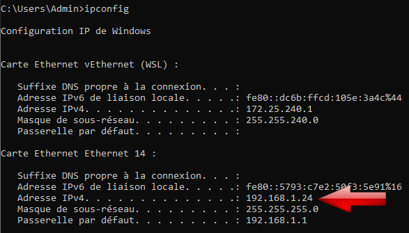
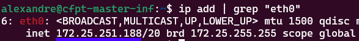
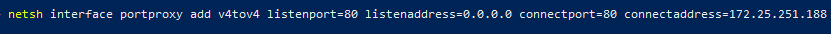
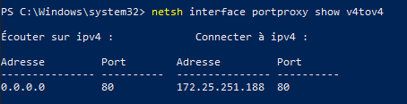

# Documentation 
## Prérequis 
Démarrer les services apache2 (sudo service apache2 start)

## 1. 
Ouvrez l'invite de commandes et tapez `ipconfig` afin de récupérer l'adresse IPv4 Windows (pas celle de WSL). 
 
 
## 2.
Tapez la commande suivante dans wsl : `ip add | grep "eth0"` pour afficher l'adresse IPv4 de WSL (celle à coté du mot inet dans la deuxième ligne).
 
 
 
## 3.
Ouvrez Powershell en administrateur et insérez la commande suivante :   `netsh interface portproxy add v4tov4 listenport=`port_souhaité` listenaddress=0.0.0.0 connectport=`port_souhaité` connectaddress=`adresse_IPv4_WSL
  
(Si vous souhaitez utiliser cette connection pour apache2, le port à indiquer est `80`)
 
 
 
 
Pour vérifier que la commande précédente ait fonctionné, entrez la commande suivante :  `netsh interface portproxy show v4tov4` 
  

## 4. 
Après, tapez :
  
`New-NetFireWallRule -DisplayName 'WSL 2' -Direction Outbound -LocalPort "`port_souhaité`" -Action Allow -Protocol TCP`  
et ensuite : 
`New-NetFireWallRule -DisplayName 'WSL 2' -Direction Inbound -LocalPort "`port_souhaité`" -Action Allow -Protocol TCP`

## 5. 
Enfin, vous pouvez tester si tout marche en inscrivant l'adresse IPv4 de Windows que nous avons récupéré dans le point 1 dans la barre d'adresse de votre navigateur internet favori sur un autre appareil appartenant au même réseau.
